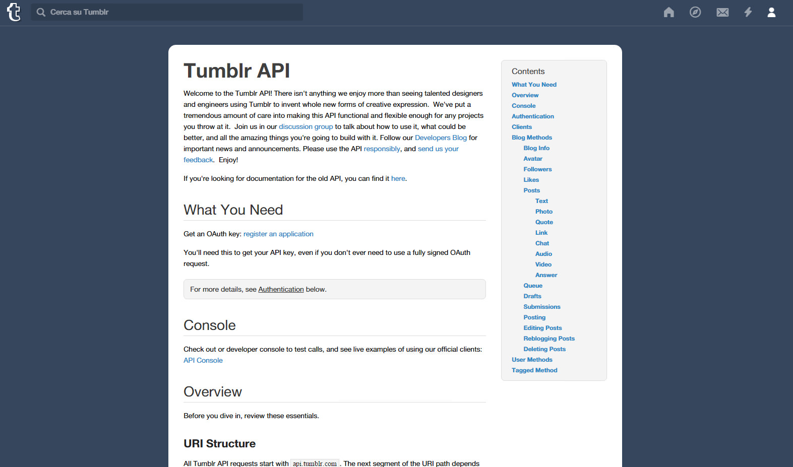

Since the first time I wrote an "Hello World" script I thought that the most exciting thing of programming is the fact that, if you know what you're doing, you can make your computer do whatever you want and, actually even better, you can control almost everything that runs on a computer. So the reason why I'm writing the second consecutive post about an API service is not because I hate you, rather because I love to control stuff and make them do things that they couldn't normally do. This time is the turn of Tumblr.



Now of course you know what is Tumblr and probably you also know what kind of contents you can find there (almost everything I would say) and if you don't have a Tumblr blog don't worry, this post is useful also for people who just want to download the entire content of any blog with just one click.
Now when we talk about API of websites like Tumblr or Facebook, is also usually necessary to talk about authentication keys and how to get them. Luckily I didn't have to request any key to do I wanted to do, infact I could easily use the one showed [here ](https://www.tumblr.com/docs/en/api/v2)just because I didn't need to perform relevant operations like deleting or posting posts (most of the times, requesting an authentication key for an API service is a very twisted process thanks to giant companies that do nothing to make the process easier).

## So why on earth you'd use this API?

Everything started yesterday when I was searching a way to save every text post of my tumblr blog, and I found two websites: [revert.io](https://revert.io/apps/tumblr) which is the very first result if you write "tumblr backup" on Google, and this [blog post](http://www.webmonkey.com/2008/10/simple_ways_to_back_up_your_tumblr_blog/) that combines the use of curl, a famous command line tool that does a lot of wonderful things, and the tumblr API to dump everything.
So revert.io was too much for what I was trying to do and plus I really hate to register accounts on websites (even using some temporary mail service) and so I decided to go for the solution showed by that blog. Unfortunately a lot has changed since that post was written in 2008 but the idea of using API to backup everything wasn't bad at all, so I read [this documentation](https://www.tumblr.com/docs/en/api/v2) and made a little script (I commented it so that you'll be able to understand everything).

## The code

```javascript
$(document).ready(function() {
  // The api key took from the example
  var authKey = "api_key=fuiKNFp9vQFvjLNvx4sUwti4Yb5yGutBN4Xh10LXZhhRKjWlV4",
    // Insert here the url of your blog
    blog = "caropollo.tumblr.com",
    // The type of the posts you want to get, leave blank to get everything
    postType = "text",
    // Specifies the post format to return as plain text (text) or HTML/Markdown (raw)
    filter = "text",
    // Number of post to return on every single call
    limit = 20,
    // Post number to start at
    offset = 0

  // Create a recursive function to move
  var getPosts = function() {
    // Put all the parameters together
    requestUri =
      "https://api.tumblr.com/v2/blog/" +
      blog +
      "/posts/" +
      postType +
      "?jsonp=?&amp;filter=" +
      filter +
      "&amp;limit=" +
      limit +
      "&amp;offset=" +
      offset +
      "&amp;" +
      authKey
    $.getJSON(requestUri, function(data) {
      data.response.posts.forEach(function(post, index) {
        // Build the html string to append to the body tag of this page
        html =
          "&lt;h2&gt;" +
          post.title +
          "&lt;/h2&gt;&lt;p&gt;" +
          post.body +
          "&lt;/p&gt;"
        $("body").append(html)
      })
      // Store the number of the posts we got in a single call
      length = data.response.posts.length
      // If the posts we got were 20 (the maximum that tumblr allow us to get through the limit parameter) we increment the offset and call the function one more time
      if (length == 20) {
        offset += 20
        getPosts()
      }
    })
  }
  // Start the recursive function
  getPosts()
})
```

It's worth to point out that I used here: a recursive function to shift the offset since Tumblr doesn't allow to get more than 20 posts in a single call and the "jsonp=?" parameter into the URIs for cross domain requests ([more here](http://www.html.it/articoli/jsonp-e-le-richieste-cross-domain-1/)).

Keep in mind that I wrote this script to suit my purpose, but honestly once you understand how this easy stuff works it's a cakewalk to adapt it to your needs (don't forget what I was saying before: if you need to perform particular operations, the authentication key in my script won't work and you should request one [here](https://www.tumblr.com/oauth/apps)).
So if we would only get the posted photos of a blog, the URI to use would be:

```
--> https://api.tumblr.com/v2/blog/caropollo.tumblr.com/posts/photo?&amp;jsonp=?&amp;filter=text&amp;limit=20&amp;offset=0&amp;api_key=fuiKNFp9vQFvjLNvx4sUwti4Yb5yGutBN4Xh10LXZhhRKjWlV4
```

Or get all the videos:

```
--> https://api.tumblr.com/v2/blog/caropollo.tumblr.com/posts/video?&amp;jsonp=?&amp;filter=text&amp;limit=20&amp;offset=0&amp;api_key=fuiKNFp9vQFvjLNvx4sUwti4Yb5yGutBN4Xh10LXZhhRKjWlV4
```

## Analyzing the response object

So as you just saw, in order to get different type of posts you must change the URI, but if you already chose a post type and now you need some simple extra information about the post like the publication date, for example, you have just to explore the response object. Let's see how Tumblr respond to this URI:

```
--> https://api.tumblr.com/v2/blog/caropollo.tumblr.com/posts/text?jsonp=?&amp;filter=text&amp;limit=20&amp;api_key=fuiKNFp9vQFvjLNvx4sUwti4Yb5yGutBN4Xh10LXZhhRKjWlV4
```

```javascript
"response": {
        "blog": {
            "title": "caropollo",
            "name": "caropollo",
            "posts": 3892,
            "url": "http:\/\/caropollo.tumblr.com\/",
            "updated": 1444402188,
            "description": "ti render\u00f2 perfetta in tutti i misteri di quelli dell'alto",
            "is_nsfw": false,
            "ask": true,
            "ask_page_title": "ask",
            "ask_anon": false,
            "submission_page_title": "submit",
            "share_likes": false
        },
        "posts": [{
            "blog_name": "caropollo",
            "id": 130815314776,
            "post_url": "http:\/\/caropollo.tumblr.com\/post\/130815314776\/io-tu-sei-un-po-come-masha-di-masha-e-lorso",
            "slug": "io-tu-sei-un-po-come-masha-di-masha-e-lorso",
            "type": "text",
            "date": "2015-10-09 14:49:48 GMT",
            "timestamp": 1444402188,
            "state": "published",
            "format": "html",
            "reblog_key": "2PETE3WP",
            "tags": [],
            "short_url": "http:\/\/tmblr.co\/ZjjHgu1vrCqjO",
            "recommended_source": null,
            "recommended_color": null,
            "highlighted": [],
            "note_count": 45,
            "title": "",
            "body": "io: Tu sei un po\u2019 come masha di masha e l'orso \n\nnipote piccola: Perch\u00e9 \n\nio: Perch\u00e9 sei un po\u2019 monella come lei \n\nnipote piccola: Non \u00e8 vero io sono un angioletto! Non dirlo pi\u00f9 o ti tiro un pugno in faccia",
            "reblog": {
                "tree_html": "",
                "comment": "&lt;p&gt;io: Tu sei un po\u2019 come masha di masha e l'orso \n\nnipote piccola: Perch\u00e9 \n\nio: Perch\u00e9 sei un po\u2019 monella come lei \n\nnipote piccola: Non \u00e8 vero io sono un angioletto! Non dirlo pi\u00f9 o ti tiro un pugno in faccia&lt;\/p&gt;"
            }
        ...
        ...
        ...
        "total_posts": 1276
}
```

## Some tips for you

If you haven't fallen asleep while you were reading, hold on, because there is an advice I'd like to give you that comes directly from the little experience that I have.
The main thing to understand when you're working with libraries, API but also when you're programming your own software is the importance of understanding the concepts. It's very good to read documentations, manuals etc. but you cannot consider yourself a programmer just because you studied books and memorized instructions.
I always say that flexibility and understanding of concepts are the keys to detach yourself from any programming language or any environment you're using, only in this way you will learn how things work.

PS = if you have some particular requests comment here or contact me, we'll figure out something together.
