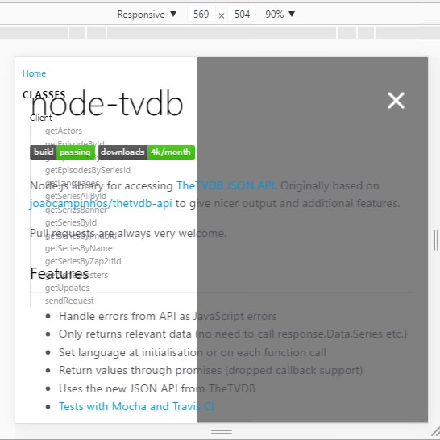
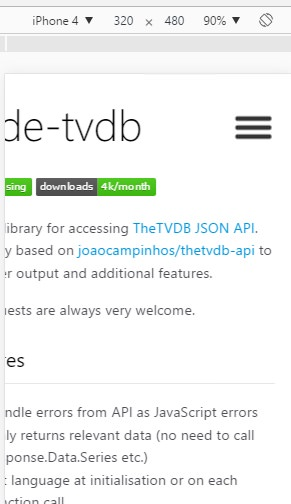
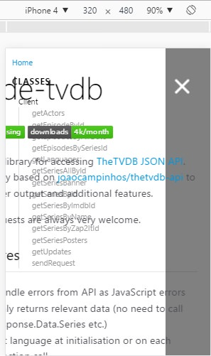

I don't know exactly how the idea of commenting pull requests here on the blog came to my mind. Maybe I've been influenced by an [italian post](https://www.raffaelegaito.com/content-marketing-startup/) on Raffaele Gaito's blog (written by Alberto Cabas Vidani whom I thank) that quoted [Gary Vee's speech](https://www.youtube.com/watch?v=RVKofRN1dyI): "Document, don't create".
Actually, without knowing anything about this interesting stuff, it's what I always did and continue to do: describe and document what I build without caring too much if the results are good or not (while I certainly keep studying to figure out how things should properly be made and improving my skills) but I never thought of document my pull requests too! They're a lot and many of them unfortunately were on a project now closed and removed from github for various reasons.

## What's node-tvdb?

Basically it's just an API wrapper built for nodejs as an npm module for [theTVDB](http://thetvdb.com) open source project! You can pull it down with `npm install node-tvdb` and start calling its methods to get information over your favourite tv shows!

## Where was the problem?

The problems weren't actually in the library itself, but in its documentation's website that, on smartphones, was completely messed up!

### Little info

If you read the package.json of the node-tvdb project, you notice that the website is being generated by jsdoc (a documentation automated generator) with a template created by the same guy that built this library.

Now follows a screenshot of the first one where some z-index were wrong and elements were overlapping on each other.



And here a screenshot of the second one. Here the `min-width` property was causing the left part of the main div to not be rendered correctly on devices with small display.



Combined it was like this:



## And now let's see the original and modified css

The problematic code in question for the z-index was this part (the lines marked with "-" were problematic and have been replaced by the "+" lines):

```css
.overlay {
  display: none;
  position: fixed;
  top: 0;
  bottom: 0;
  left: 0;
  right: 0;
   width: 100%;
   height: 100%;
   background: hsla(0, 0%, 0%, 0.5);
-  z-index: 1;
+  z-index: 4;
 }

 @media only screen and (min-width: 320px) and (max-width: 680px) {
  body {
    overflow-x: hidden;
  }

  nav {
    background: #FFF;
    width: 250px;
    height: 100%;
    position: fixed;
    top: 0;
     right: 0;
     bottom: 0;
     left: -250px;
-    z-index: 3;
+    z-index: 4;
     padding: 0 10px;
     transition: left 0.2s;
   }

  .navicon-button {
    display: inline-block;
     position: fixed;
     top: 1.5em;
     right: 0;
-    z-index: 2;
+    z-index: 5;
   }
```

And this was for the min-width problem:

```css
#main,
  footer {
    float: right;
  -  min-width: 360px;
    width: calc(100% - 240px);
    position: relative;
    z-index: 3;
  }

 .navicon-button {
   display: inline-block;
   position: fixed;
   top: 1.5em;
   right: 0;
   z-index: 5;
 }

  #main {
    width: 100%;
-    min-width: 360px;
  }
```

This is the [link of the pull request](https://github.com/edwellbrook/minami/pull/2) made with these changes.

## Conclusion

I hope someone enjoyed this! See you again at the next post ;)
