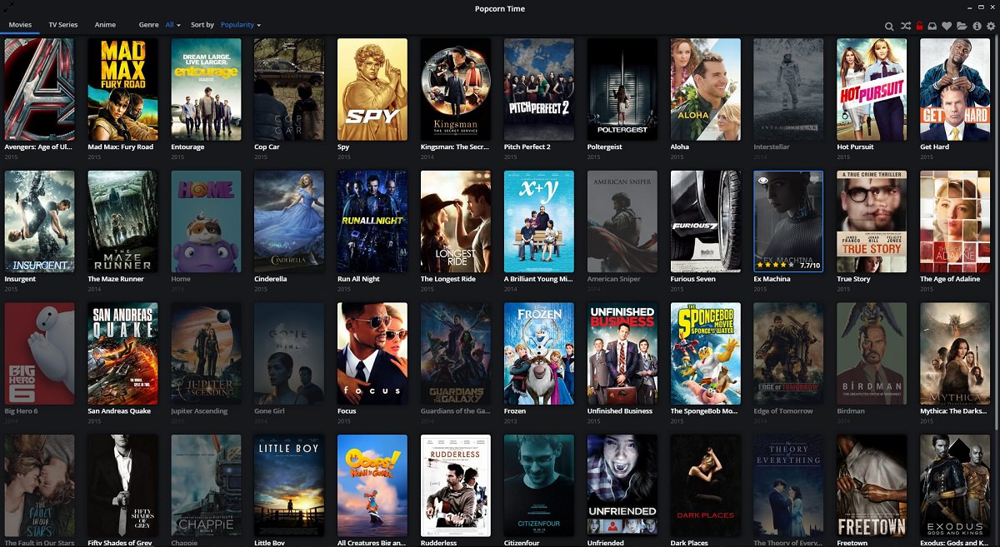

> _The only people who don't love Popcorn Time are the people who still don't know it... and the cops of course!_

I think this is the truest thing I've ever said, it seems a famous movie quote. So today we're going to talk about the Popcorn Time's API that allows developers to execute actions without using the desktop application. For those who don't know what we're talking about, Popcorn Time is an application born some time ago that gives you the possibility of watching tons of Tv Shows, Movies and Anime completely free using the p2p protocol. Given its simplicity with its user-friendly interface, you can consider it as "the Netflix killer" if you want, here is a screenshot of the interface:



The great thing actually is that we have also the possibility to control Popcorn Time remotely and so wherever we are, we can choose the movie, turn down the volume, toggle the fullscreen mode, search for a TV show and do every other thing you could normally do on the desktop application. We're able to communicate remotely with PT thanks to the implementation of the json-rpc protocol to listen for method calls. So other developers created websites and apps for smartphones that allow everyone to control PT, you can<span style="line-height: 1.5;"> already find an app on the Play Store. </span><span style="line-height: 1.5;">In the meantime I thought to develop my own remote and so I started developing the library that would have handeld the protocol and the API's methods:</span><span style="line-height: 1.5;"> </span>[popcorntime_remote.js](https://github.com/giacomocerquone/popcorntime_remote.js/) <span style="line-height: 1.5;">and I'm still developing the </span>[popcorn time remote controller](http://popremote.giacomocerquone.com/)<span style="line-height: 1.5;">, they're both hosted on github and you're also free to use my library or to study the remote controller's code.</span>

But how does the Popcorn Time API's work?
First of all you need to know how the json-rpc works, so if you don't know it [here some information](https://en.wikipedia.org/wiki/JSON-RPC)... actually it's very simple, here an example of a general call with its response:

```javascript
--> {"jsonrpc": "2.0", "method": "methodname", "params": ["p1", "p2"], "id": 1}
<-- {"jsonrpc": "2.0", "result": 19, "id": 1}
```

So now that we know how it works we're ready to discover what methods PT let us use. Luckily we have [this documentation](https://git.popcorntime.io/popcorntime/desktop/blob/master/docs/json-rpc-api.md) hosted on gitlab that tells us all the methods and their parameters. The thing to do here is just make the json string and then perform a simple POST ajax call with javascript to the local ip of the computer that is running PT and to the right port written in the settings of the desktop application... it should be something like "http://192.168.1.5:8008/.
So if we would like to call the method "enter", that simulates the pression of the enter button, we just need to compose the string in this way:

```javascript
{"jsonrpc": "2.0", "method": "enter", "params": [], "id": 1}
```

If we want to set the volume to 50%:

```javascript
{"jsonrpc": "2.0", "method": "enter", "params": ["0.5"], "id": 1}
```

And so on, but here comes what I worked for. So I stop here to explain stuff because I developed that library to keep things even easier for you because having something already written in this occasions is better, so you can focus on the application you want to build and nothing else but it's important to say that I usually dislike libraries and always try to not use them.

In fact, honestly, to use my library you don't need to know anything about json-rpc or ajax calls, you just need to call methods and get the response (if there is a response). You can find examples about my library directly on the [project page of github](https://github.com/giacomocerquone/popcorntime_remote.js).

As soon as I finish the popcorn time remote controller I'll do a post for that too.
