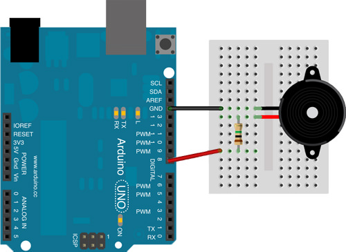
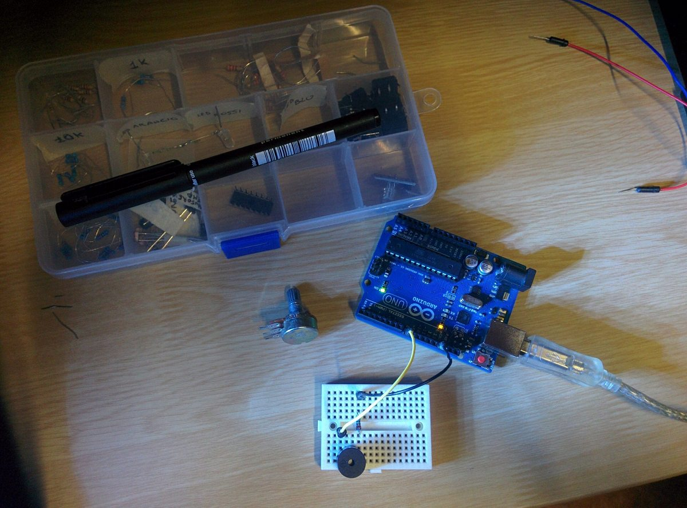

So Christmas is coming and everyone are about to put wonderful coloured trees in their houses. This year we bought a new tree because the old one was really too old, it had more than 20 years and I'm just 19... so when my mum and dad bought it, I wasn't even born! But we didn't change the rest, so we have always the same old decorations and between balls, and lights there is this little Santa Claus shaped box that has a buzzer inside that **should** play some christmas songs, but guess what? It can barely play a distorted whistle. So for other reasons I had an arduino UNO at hands and I asked my mum if she wanted a new thing to play some Christmas songs, she said yes and here we are!
[Here](http://github.com/giacomocerquone/arduino-jingle-bell) you can find the github repo for the code.

## Requirements

1.  Arduino Uno
2.  Buzzer
3.  220Ω resistor (but you don't need it if you want to destroy your buzzer!)
4.  Case, wires and a little breadbord

## Wiring



## Working

I started developing the application with the buzzer and the resistor on the breadbord. (as you can see from the photo I thought to use a potentiometer to adjust the volume, but the one that I have is 50K and it's too much for the buzzer)



After I took the case and I made two holes on it (one for the wirings and another for the 5v power supply) and I put the arduino inside it and the breadbord outside. The final result is the image you saw above. On the github's readme you can find two ideas I left there to let people who wants to build it to improve it.

## The code

This isn't the first time that I make this arduino play something with the buzzer. The first time me and my friend translated the imperial march of Star Wars notes to frequences in an arduino sketch calculating manually the pauses and adding them line by line. I lost that piece of code and now I coded this song in a better way using simple cycles and arrays. Let's have a look:

```c++
int buzzerPin = 8;
int tempo = 200;
char notes[] = "eeeeeeegcde fffffeeeeddedg";
int duration[] = {1, 1, 2, 1, 1, 2, 1, 1, 1, 1, 2, 1, 1, 1, 1, 1, 1, 1, 1, 1, 1, 1, 1, 1, 2, 2};

void playTheShit(char note, int duration) {
  char notesName[] = { 'c', 'd', 'e', 'f', 'g' };
  int tones[] = { 261, 293, 329, 349, 392 };

  for (int i = 0; i &lt; sizeof(tones); i++) {
    // Bind the note took from the char array to the array notesName
    if (note == notesName[i]) {
      // Bind the notesName to tones
      tone(buzzerPin, tones[i], duration);
    }
  }
}

void setup() {
  pinMode(buzzerPin, OUTPUT);
}

void loop() {
  // Scan each char from "notes"
  for (int i = 0; i &lt; sizeof(notes)-1; i++) {
    if (notes[i] == ' ') {
      // If find a space it rests
      delay(duration[i] * tempo);
    } else {
      playTheShit(notes[i], duration[i] * tempo);
    }

    // Pauses between notes
    delay((tempo*2)*duration[i]);
  }
}
```

## Conclusion

I hope that if you'll or you already did something even better than this little thing, you'll link it to me through comments or social networks, but most important I wish you a merry merry christmas and I hope it'll be the best Christmas you've ever had.
