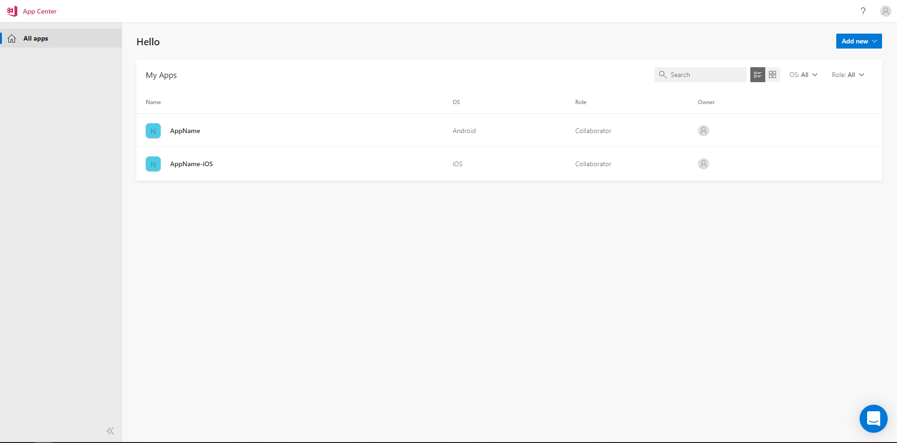
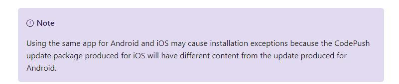

The world has been spinning pretty fast lately, hasn't it?
In the development process what we're used to call "**continuous delivery**" is what allowed us, as end-users, to perceive changes in a blazingly fast way and it's what allows us, as developers, to **push fixes** and new features faster to the end-user.

You'll find **so many** articles about it and maybe you still are figuring out what it really is but remember, these apparently abstract and hard to follow concepts that pops up here and there nowadays always boil down somehow to something practical: a tool, a service or an architecture that let you do something.

But how can we effectively do this in the world of mobile development? Through **over-the-air** updates.
It's the ability of an app to receive bugfixes and features that can be **applied at runtime** and refresh the user experience. This means no store approval, no build time and lots of other simplifications.

_NOTE: **I'll keep this guide updated** at the best of my possibilities for every react-native-code-push update. If you feel something is missing, ping me on [Twitter](https://twitter.com/giacomocerquone) or send me an email_

## General inner working

I won't talk about other platforms, but OTA updates aren't possible on every framework due to their different inner workings.
In React Native we are "required" to build a **JavaScript bundle** to produce a production app. That js bundle, called index.android.bundle in Android and main.jsbundle in iOS, is bundled within the aab/apk/ipa and then the Java/Obj-C code of our React Native app will use it.
So how are OTA delivered? Simple, replacing that bundle, when certain conditions are met, through a native linked library that restarts the execution of that bundle at runtime.

Now **understanding how something works** is the only way you can **improve yourself** and become as independent as possible. I might also have tempted a personal implementation of this mechanism, but it'd be silly since we have **Microsoft CodePush**: a tool, inside the app center, made exactly to deliver OTA updates.

## Configuration

Online resources are a bit scarce on how to:

- Use the [appcenter.ms](http://appcenter.ms/apps) website dashboard
- Properly configure this library
- Use the appcenter cli

There is a [huge unhandy Microsoft documentation](https://docs.microsoft.com/en-us/appcenter/) about it, but at the same time, it's possible to find many commands out in the wild of the **old version** of the cli that don't work anymore.

## Configure the app in the App Center dashboard

There shouldn't be the need of explaining how the app should be set up on the App Center dashboard but, it turns out there is a very peculiar thing I discovered and so I decided to walk you step by step in this.

1. Signup
2. Go to your [apps' dashboard](https://appcenter.ms/apps).
3. You'll need to add two apps.  Basically, you can't configure a single app (and therefore use a single key) to release updates to both your Android and iOS apps. **You must configure two apps targeting two different OS**. This is confusing also because an old version of the cli allowed to specify multiple OS of a single app when releasing the updates.*
Configure them like this, once selecting iOS and once Android in the OS field (leave the Release Type empty, this has nothing to do with CodePush):

4. Open your app and on the left panel select "Distribute -> CodePush -> Create standard deployments"
5. You'll have a dropdown selection and a wrench icon in the upper-right corner!
The **dropdown** indicates the current deployment name you're viewing, the **wrench icon** lets you open a side-panel which gives you **the keys** your app will use to retrieve the bundles (store this somewhere momentarily in order to use them in the next steps).

That's it.

_*NOTE: in the docs this is taken for granted and nowhere seems to be mentioned, the only warning you can find is this and it doesn't tell us much_



## Linking and JS implementation

The entire library is going under heavy maintenance (almost abandoned I'd say, like lots of React native Microsoft contributions) and for this reason, something may be a bit outdated and something else might be missing: **no hooks support**, **no autolinking support**.
It exposes a HOC or some "low level" functions we can use to configure how the updates should be retrieved by the app ([here the doc](https://github.com/microsoft/react-native-code-push/blob/master/docs/api-js.md)).
Since this library doesn't support auto-linking, when installed you must launch **react-native link react-native-code-push** and it will ask you for **only one** of the key retrieved at the previous step.
My advice here is:

1. **Write it in the terminal** while linking if you know you'll just use one deployment key for your app (the key relative to the _Production_ deployment name for example).
2. Leave it empty if you plan to use various deployments (_Production_, _Staging_ ecc.) to effectively **handle the keys from the js side**.

The first one has a **simpler js configuration**, you just need to wrap your app entry point with the CodePush HOC. Something like:

```JSX
function MyApp() {
  return null
}

export default codePush(MyApp);
```

The second one instead requires us to specify the Code Push-Key inside the codePush HOC:

```JSX
function MyApp() {
  return null
}

export default codePush({
  deploymentKey: 'YOURKEY'
}: CodePushOptions)(MyApp);
```

You can check the **CodePushOptions type** [here](https://github.com/microsoft/react-native-code-push/blob/master/docs/api-js.md#codepushoptions). It allows us to set all kinds of behaviors when an update is available to be downloaded. Alerts, percentage progress, completely silent, apply at restart, etc. etc.

_NOTE: Pay attention to when you'd like to hide your splash screen or stop your loader since you might also want to completely hide the whole process to the user. You can do it through the second parameter of the CodePush key which is an update callback to retrieve the process status_

I want also to be very clear about the second way I proposed:

- **It isn't the only way** to use multiple keys (the easier for me)
- It is **very dangerous** to use it without a _safe and good env vars handling in react-native_ (**this will be my next post's topic**) which is almost impossible considering the tools and libs we have at the moment.

## Important CLI commands

Let's see a handy **collection** of the main useful commands you can refer to <br/>

_NOTE: Microsoft calls it deployment name (or simply deployment), it is also often referred to as lanes, product flavors, build schemes or also specific deploy and they indicate some sort of specific configuration of your app: stage, dev, production, production-IT ecc._

#### DEPLOY (to a deployment name)

```
appcenter codepush release-react -a <owner>/<appName> -d <deploymentName> -t <version>
```

#### LIST APPS FOR CURRENT USER

```
appcenter apps list
```

#### ADD A DEPLOYMENT NAME (to an app)

```
appcenter codepush deployment add -a {owner}/{appName} <deploymentName>
```

#### LIST DEPLOYMENT NAMES AND KEYS (of an app)

```
appcenter codepush deployment list -a {owner}/{appName} --displayKeys
```

#### DELETE ALL EXISTING RELEASES (of a deployment name)

```
appcenter codepush deployment clear -a <ownerName>/<appName> <deploymentName>
```

#### UNDO LAST RELEASE (of a deployment name)

```
appcenter codepush rollback -a <owner-name>/<app-name> <deploymentName>
```

#### DISABLE SPECIFIC RELEASE (of a deployment name)

```
appcenter codepush patch -a <owner-name>/<app-name> <deploymentName> <existingReleaseLabel> --disabled
```

`patch` is a very powerful utility that lets you modify a release. [Make sure to check out the docs](https://docs.microsoft.com/en-us/appcenter/distribution/codepush/cli#patching-update-metadata) to discover what you can do with it!

_NOTE: the difference between disabling and rolling back is that the first one just disable a release so the app will get the previous one while the rollback create a new release equal to the second-last release to nullify the latest_

If you need any kind of support, **reach out to me on Twitter**, I'd be glad to help.
