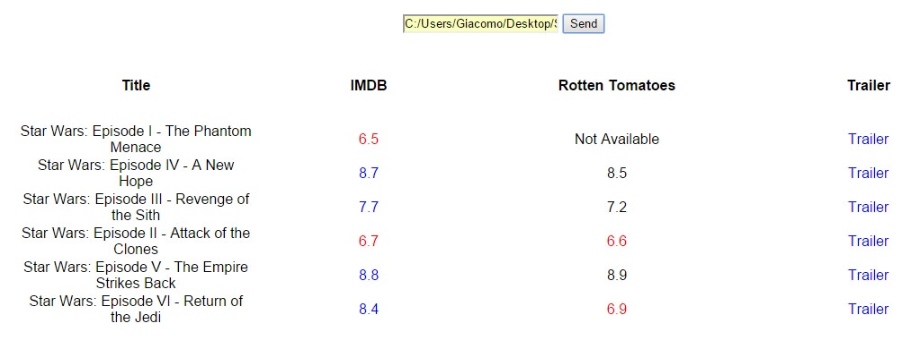

Only the ones who are affected from the collector's bug know what really means to have thousands and thousands of movies in Hard Drives without the possibility to watch them. I was really annoyed of this situation: in fact I'm well known to be extremely minimalist and a damn control freak... my rommate knows this very very well, in my family's house I used to throw out the impossible and everytime I put things in order I come out with plenty of full bags of garbage, it's a lifestyle.
For this reason I had to do the same thing with the movies that were stored in the NAS that I built almost two years ago (don't worry if you're bored, you'll be even more when I'll do a post for that too). So one afternoon a few days ago I was in my dad's car to go back to my university's house and since I was bored I started developing this very little thing right in the car. The trip took one hour and for the time I was arrived I had already a first version of the app.

## So what did you do and why?

So there were these movies that I kept for a long time for no reason, I started to watch a big part of them quite some time ago and I noticed that a lot of them were crap and a lot of others were not so much good to deserve to use my gigabytes so I decided to create something that could fastly show me (all together) info, ratings and trailers of all the movies, and the ones that hadn't a certain minimum rating were highlighted.

If you want to take a look to the code [here is the github repo](http://github.com/giacomocerquone/Movies-Lookup.git), [here the npm page](https://www.npmjs.com/package/movies-lookup), and now follows a screen of what it is (read the final notes to know why it's so ugly):

## Final notes

Now I want to specify something I wrote also on the readme of the github repo (that you probably already understood from the horrible interface): **this is not an application made for the public. **I don't know if I'll ever have the time to develop this idea in a truly better way, but the plans are to avoid completely node.js that I used only to save an incredibly amount of time using libraries and API that were already developed by others.
