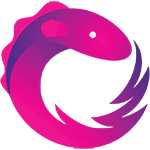
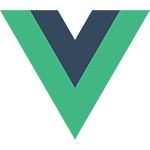

What have you been up to these two months of this new year? I hope you're all enjoying working on your projects and that your technologies stack is always up to date in order to experience the most from your languages and frameworks.
Currently I'm working on two big react-native projects and I'm trying to get the most out of the react/redux world but I want also to improve my skills about something else.
Let's talk then about what do I wanna learn, at the moment, during this year.

## What to learn

### 
Rxjs

More than three years ago, when I started studying on the beta version of the new Angular framework, I've always been fascinated about the concept of Observable that's deeply nested in the foundation of this framework but never completely mastered them along with this reactive programming technique that has been around for quite some time now.
[The official doc](http://reactivex.io/rxjs/) contains basically all you need to know about it.

_Curiosity: actually the first paper about Reactive Programming dates [back to 1989](http://www-sop.inria.fr/members/Gerard.Berry/Papers/Berry-IFIP-89.pdf)_

### 
Vue

Considering that I'm becoming pretty good in React/Redux and I knew enough about Angular, I absolutely can't miss this "new" front-end framework to "master" the triplet.
I've heard a lot about it and I used it for a very short period beforing diving into React some time ago and I actually remember having really a lot of fun with it. I'll make sure to reach out [the official doc](https://vuejs.org/v2/guide/) to make the first moves.

_Curiosity: This too is a bit old as a framework. There was a first version previous to this one that has been almost completely rewritten somewhat like two years ago_

### 
GraphQL

This is another interesting technology developed by Facebook that is perfectly placed in the middle between the front-end and the back-end. Beeing a javascript enthusiast, I enjoy writing the back end of my personal projects too and I will be sure to implement this new query language (yes, it is actually considered like so).
I'd personally start from the [official introduction](http://graphql.org/learn/)

### 
Some BE Language/Framework   (PHP/Laravel probably)

I always considered myself a developer and not a front-end or a back-end one. I enjoy writing code, but it doesn't differ if I write it for a presentational matter or an architectural one.
So what I always say is "learn":

> Don't mind if it will be useless, but learn it if you like.

I won't use PHP at work probably but knowing also a back-end language and a framework that is not based on javascript is for sure a good thing to do and the only doubt here is which framework to chose (I'm undecided between Symfony and Laravel).
If I should decide based on the number of stars on the respective github projects, then the winner would be Laravel but actually the more requested one, and also the one that is used more by big companies, seems to be Symfony... then we'll see what to do!

## Conclusion

I hope I will be able to keep these promises in order to become better in what I do and specialize always more in my job.
What will you learn this year? :)

_Photo by Kelly Sikkema for Unsplash_
